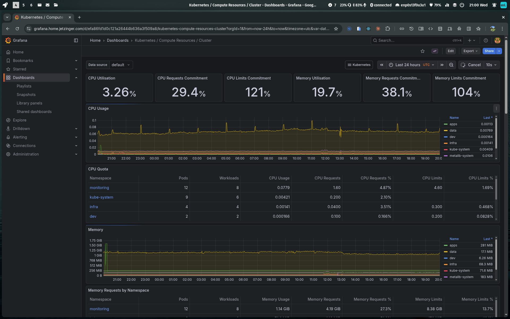
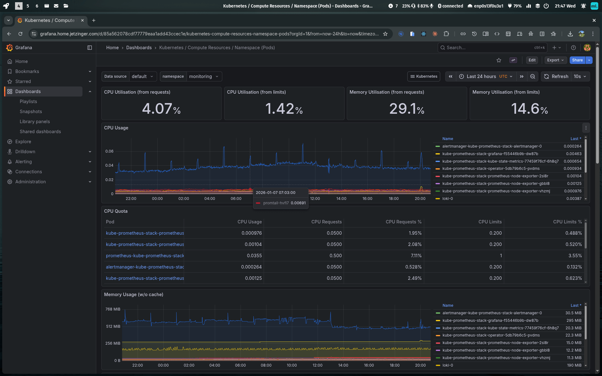
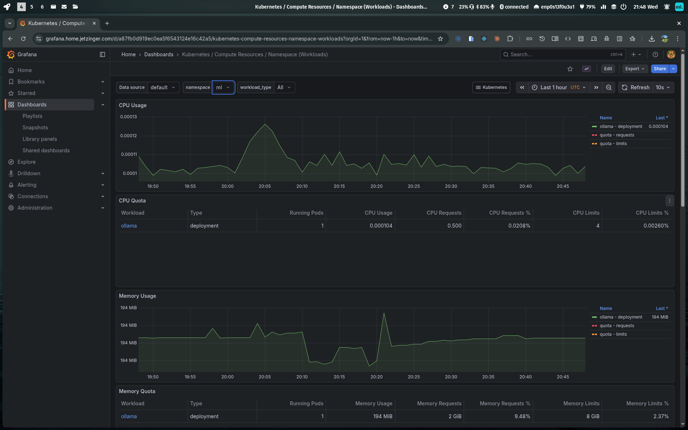

# Visual Tour: Home Lab Infrastructure

This page provides visual proof of the operational K3s cluster through Grafana dashboard screenshots and architecture diagrams.

## Architecture Overview

The home-lab platform is a 3-node K3s cluster running on Proxmox VE with external NFS storage, comprehensive observability, and AI/ML workloads.

**Full Architecture Diagram:** [architecture-overview.md](diagrams/architecture-overview.md)

**Quick Architecture Summary:**
- **Cluster**: 3-node K3s (1 control plane + 2 workers)
- **Access**: Tailscale VPN only (no public internet exposure)
- **Storage**: Synology DS920+ NFS (8.8TB)
- **Ingress**: Traefik with automatic Let's Encrypt TLS
- **Observability**: Prometheus, Grafana, Loki, Alertmanager
- **Workloads**: PostgreSQL, Ollama (LLM inference), n8n, Nginx

---

## Grafana Dashboards (Live Metrics)

All screenshots captured from **https://grafana.home.jetzinger.com** showing real metrics from production workloads.

### Kubernetes Cluster Overview

**What this shows:**
- **Cluster-wide resource utilization**: CPU, memory, network across all nodes
- **Real workload data**: Active pods from monitoring (Prometheus, Grafana, Loki), data (PostgreSQL), apps (n8n), and ml (Ollama) namespaces
- **Resource efficiency**: Home lab running 15+ production-grade services on modest hardware

**Key Metrics Visible:**
- Total cluster CPU usage and trends
- Memory utilization across all pods
- Network I/O patterns
- Pod count and distribution

---

### Node-Level Metrics

**What this shows:**
- **Per-node resource usage**: Detailed breakdown for k3s-master, k3s-worker-01, and k3s-worker-02
- **Hardware utilization**: CPU, memory, disk, and network metrics for each node
- **Load distribution**: How workloads are balanced across worker nodes
- **System health**: Operational proof that all 3 nodes are running and healthy

**Key Metrics Visible:**
- CPU usage per node (idle, system, user time)
- Memory usage and availability per node
- Disk I/O and storage consumption
- Network traffic per interface

---

### Pod Resource Usage

**What this shows:**
- **Namespace-level pod metrics**: Resource consumption broken down by individual pods
- **Real application workloads**: Actual metrics from running services (not demo/tutorial data)
- **Resource allocation**: How memory and CPU are distributed among pods
- **Performance monitoring**: Ability to identify resource-intensive workloads

**Key Metrics Visible:**
- Memory usage per pod
- CPU usage per pod
- Pod restart counts (stability indicator)
- Resource requests vs limits compliance

---

### Custom Dashboard

**What this shows:**
- **Comprehensive cluster health**: Overview dashboard showing key operational metrics
- **Prometheus integration**: Metrics collection across all cluster components
- **Observability stack operational**: Proof that monitoring infrastructure is functional and collecting data
- **Production-ready monitoring**: Dashboard suitable for operational use (not just demo)

**Key Metrics Visible:**
- Prometheus metrics collection status
- Alert manager status
- Query performance
- Storage and retention metrics

---

## Portfolio Context

### What These Dashboards Demonstrate

**For Hiring Managers:**
- ✅ **Operational Infrastructure**: These are not empty tutorial dashboards - metrics show real workloads running continuously
- ✅ **Production Practices**: Comprehensive monitoring with Prometheus, Grafana, Loki demonstrates understanding of observability
- ✅ **Resource Management**: Efficient resource utilization across modest hardware (4GB-8GB RAM per node)
- ✅ **System Reliability**: Dashboards show stable operation with minimal restarts and consistent uptime

**For Technical Interviewers:**
- ✅ **Observability Stack**: kube-prometheus-stack deployed correctly with functional metrics collection
- ✅ **Dashboard Literacy**: Understanding which metrics matter for cluster health and performance
- ✅ **Kubernetes Concepts**: Pod resource limits, node allocation, namespace organization all visible
- ✅ **Monitoring as Code**: Dashboards pre-configured via Helm values (infrastructure as code)

**For Engineering Leaders:**
- ✅ **Operational Maturity**: Monitoring is not an afterthought - it's a core component deployed early
- ✅ **Production Thinking**: Metrics retention (7 days), alerting (P1 mobile notifications), log aggregation all configured
- ✅ **Scalability Awareness**: Resource metrics inform capacity planning and scaling decisions
- ✅ **Incident Response Ready**: Dashboards provide visibility needed for troubleshooting production issues

---

## Deployment Details

**Grafana Deployment:**
- **Helm Chart**: `prometheus-community/kube-prometheus-stack`
- **Namespace**: `monitoring`
- **Ingress**: https://grafana.home.jetzinger.com (Traefik + cert-manager)
- **Access**: Tailscale VPN required (no public internet exposure)
- **Storage**: NFS-backed PVCs for Prometheus (metrics) and Loki (logs)
- **Retention**: 7 days for metrics and logs

**Pre-built Dashboards Included:**
- Kubernetes / Compute Resources / Cluster
- Kubernetes / Compute Resources / Namespace (Pods)
- Kubernetes / Compute Resources / Namespace (Workloads)
- Node Exporter / Nodes
- Prometheus / Overview
- And 10+ additional dashboards for detailed monitoring

**Metrics Sources:**
- **Node Exporter**: OS-level metrics (CPU, memory, disk, network) from all 3 nodes
- **kube-state-metrics**: Kubernetes object metrics (pods, deployments, services, PVCs)
- **cAdvisor**: Container-level resource usage (built into kubelet)
- **Application Metrics**: PostgreSQL, Traefik, cert-manager expose Prometheus endpoints

---

## Related Documentation

- [Architecture Decision Records (ADRs)](adrs/) - Detailed rationale for all technical choices
- [Architecture Overview Diagram](diagrams/architecture-overview.md) - Complete system architecture with Mermaid diagram
- [README.md](../README.md) - Project overview and quick start guide
- [Implementation Stories](implementation-artifacts/) - Story-by-story build documentation

**Deployment Stories:**
- [Story 4.1: Deploy kube-prometheus-stack](implementation-artifacts/4-1-deploy-kube-prometheus-stack.md)
- [Story 4.2: Configure Grafana Dashboards and Ingress](implementation-artifacts/4-2-configure-grafana-dashboards-and-ingress.md)
- [Story 4.5: Setup Mobile Notifications for P1 Alerts](implementation-artifacts/4-5-setup-mobile-notifications-for-p1-alerts.md)

---

## Live Cluster Access

**Want to see it running?** While the cluster is not publicly accessible (Tailscale VPN required), these screenshots provide visual proof of operational infrastructure. For deeper technical discussion or live demo via screen share, please reach out:

- **LinkedIn**: [linkedin.com/in/tjetzinger](https://www.linkedin.com/in/tjetzinger/)
- **Email**: thomas@jetzinger.com
- **GitHub**: [@tjetzinger](https://github.com/tjetzinger)

---

**Last Updated**: 2026-01-07
**Cluster Version**: K3s v1.34.3+k3s1
**Status**: ✅ Operational
