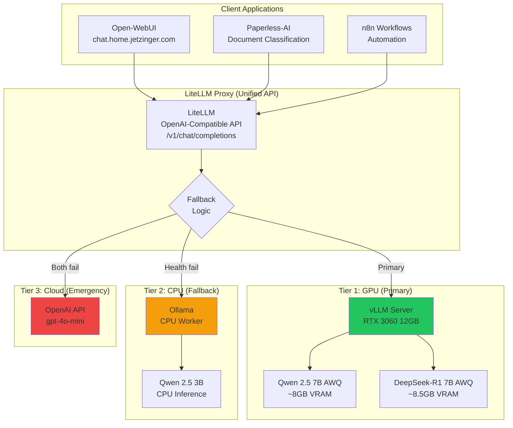
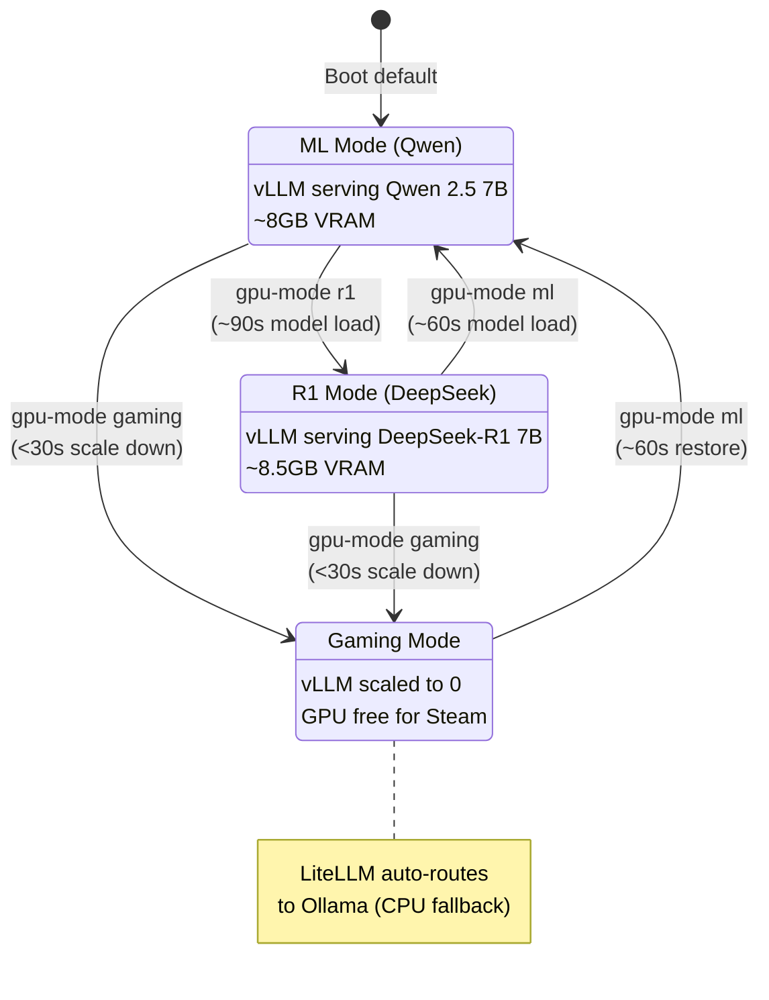
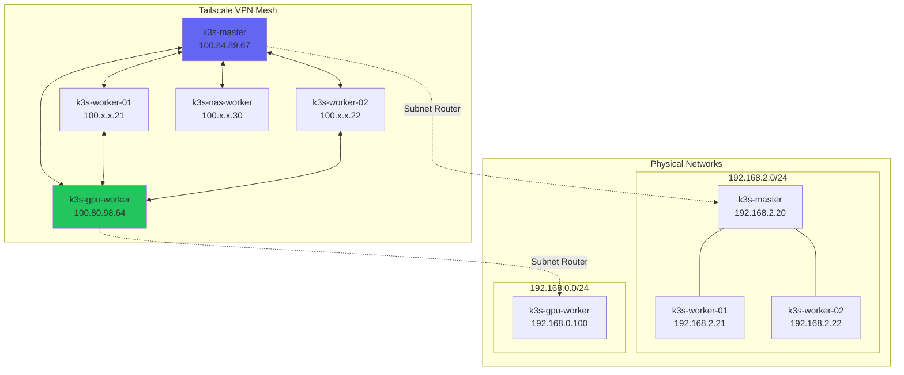
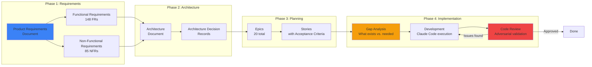

# 20 Epics, 148 Requirements, 1 AI Pair Programmer: Building a Production-Grade ML Platform

**Published:** [TBD - awaiting dev.to publication]
**Author:** Thomas Jetzinger
**Reading Time:** ~15 minutes
**Word Count:** ~3,600 words

---

## Introduction

Twenty epics. One hundred forty-eight functional requirements. Eighty-five non-functional requirements. One AI pair programmer.

What started as a three-node K3s learning project became a full ML inference platform running production workloads 24/7. My RTX 3060 now serves DeepSeek-R1 reasoning queries during the day and runs Steam games at night—through the same mode-switching script that gracefully degrades to CPU fallback when I'm playing Factorio.

This isn't a tutorial walkthrough or a "deploy Kubernetes in 10 minutes" guide. This is a technical deep-dive into building real infrastructure: the architecture decisions, the GPU memory constraints, the Tailscale mesh that connects nodes across different subnets, and the AI-assisted engineering workflow that tracked every requirement from PRD to implementation.

For hiring managers: this demonstrates operational capability, not tutorial completion. For technical peers: the architecture details are real, with links to the actual code. For career changers: this is what systematic learning looks like—not random tutorials, but a structured methodology that produces portfolio-worthy evidence.

**TL;DR:** A 5-node K3s cluster with GPU inference, three-tier ML fallback, dual-use GPU mode switching, and complete observability—built using AI-assisted engineering with every decision documented.

---

## Platform Overview

### The Cluster

The home-lab runs on a 5-node K3s cluster spanning two physical networks:

| Node | Role | Specs | Purpose |
|------|------|-------|---------|
| `k3s-master` | Control plane | Proxmox VM (192.168.2.20) | API server, etcd, scheduler |
| `k3s-worker-01` | CPU worker | Proxmox VM (192.168.2.21) | General workloads |
| `k3s-worker-02` | CPU worker | Proxmox VM (192.168.2.22) | General workloads |
| `k3s-gpu-worker` | GPU worker | Intel NUC + RTX 3060 eGPU (192.168.0.100) | ML inference (vLLM) |
| `k3s-nas-worker` | NAS worker | Synology DS920+ VM | Storage-adjacent workloads |

The journey from "install K3s" to "production ML platform" involved 20 epics:

1. K3s Foundation & Remote Access
2. NFS Storage & Persistence
3. Ingress, TLS & Service Exposure
4. Observability Stack (Prometheus/Grafana/Loki)
5. PostgreSQL Database Service
6. AI Inference Platform (Ollama)
7. Development Proxy
8. Cluster Operations & Maintenance
9. Portfolio & Documentation
10. Paperless-ngx Document Management
11. Dev Containers Platform
12. GPU/ML Inference Platform (vLLM)
13. Steam Gaming Platform (Dual-Use GPU)
14. LiteLLM Inference Proxy
15. Tailscale Subnet Router
16. NAS Worker Node
17. Open-WebUI (ChatGPT Interface)
18. Kubernetes Dashboard
19. Gitea (Self-Hosted Git)
20. DeepSeek-R1 Reasoning Support

**Scale achieved:** 148 functional requirements, 85 non-functional requirements, all tracked from PRD to implementation.

### Technology Stack

The platform uses production-grade tooling throughout:

| Layer | Technology | Why This Choice |
|-------|-----------|----------------|
| **Orchestration** | K3s v1.34.3 | Lightweight, production-ready K8s with half the memory footprint |
| **GPU Inference** | vLLM | High-performance serving with AWQ quantization support |
| **LLM Proxy** | LiteLLM | Unified OpenAI-compatible API with automatic failover |
| **Storage** | NFS (Synology DS920+) | Leverage existing NAS investment, snapshot support |
| **Ingress** | Traefik | K3s bundled, zero-config, automatic cert renewal |
| **TLS** | cert-manager + Let's Encrypt | Automated certificate management |
| **Load Balancer** | MetalLB (L2) | Simple home network setup without BGP |
| **Observability** | kube-prometheus-stack + Loki | Complete metrics, logs, alerting stack |
| **VPN** | Tailscale | Zero-config mesh networking, subnet routing |

Every choice has a documented rationale in the [Architecture Decision Records](https://github.com/tjetzinger/home-lab/tree/master/docs/adrs).

---

## ML Inference Stack

The heart of this platform is a sophisticated ML inference system with automatic failover. When you query the cluster for an LLM completion, your request routes through a three-tier architecture designed for reliability and cost efficiency.

### Architecture: Three-Tier Fallback



**How it works:**

1. **LiteLLM Proxy** provides a unified OpenAI-compatible endpoint at `http://litellm.ml.svc.cluster.local:4000/v1`
2. **Primary (vLLM on GPU):** Requests route to vLLM running on the RTX 3060. At 35-40 tokens/sec with 8K context, it handles most workloads efficiently.
3. **Fallback (Ollama on CPU):** If vLLM health check fails (GPU in gaming mode, pod crash), LiteLLM automatically routes to Ollama running Qwen 2.5 3B.
4. **Emergency (OpenAI cloud):** If both local options fail, requests fall back to gpt-4o-mini. This costs money but ensures service continuity.

### The LiteLLM Configuration

```yaml
# Three-tier fallback chain
model_list:
  # Tier 1: vLLM on GPU (primary)
  - model_name: vllm-qwen
    litellm_params:
      model: openai/Qwen/Qwen2.5-7B-Instruct-AWQ
      api_base: http://vllm-api.ml.svc.cluster.local:8000/v1
      timeout: 30

  # Tier 1b: DeepSeek-R1 (reasoning mode)
  - model_name: vllm-r1
    litellm_params:
      model: openai/casperhansen/deepseek-r1-distill-qwen-7b-awq
      api_base: http://vllm-api.ml.svc.cluster.local:8000/v1
      timeout: 60  # Extended for reasoning chains

  # Tier 2: Ollama on CPU (fallback)
  - model_name: ollama-qwen
    litellm_params:
      model: ollama/qwen2.5:3b
      api_base: http://ollama.ml.svc.cluster.local:11434
      timeout: 120  # Cold cache model loading

  # Tier 3: OpenAI (emergency)
  - model_name: openai-gpt4o
    litellm_params:
      model: gpt-4o-mini
      api_key: os.environ/OPENAI_API_KEY

litellm_settings:
  # Fallback chain definition
  fallbacks:
    - {"vllm-qwen": ["ollama-qwen"]}
    - {"ollama-qwen": ["openai-gpt4o"]}
  allowed_fails: 1
  cooldown_time: 30
```

### Real Performance Numbers

On the RTX 3060 with 12GB VRAM:

- **Qwen 2.5 7B AWQ:** 35-40 tokens/sec, ~8GB VRAM, 8K context
- **DeepSeek-R1 7B AWQ:** 30-35 tokens/sec, ~8.5GB VRAM, reasoning with chain-of-thought
- **Model switch time:** ~60-90 seconds (full model reload)
- **Failover detection:** <5 seconds (NFR65)

The 7B models fit comfortably. I originally planned for 14B models, but KV cache requirements exceeded the 12GB limit. When a model processes long contexts, the KV (key-value) cache grows linearly with sequence length. A 14B model with 8K context would need roughly 11GB just for weights and cache—leaving no headroom for inference. The 7B models provide excellent quality for document classification and general queries while staying well within the memory budget.

### Consumers: Real Workloads

The ML inference stack isn't theoretical—it powers real applications:

**Open-WebUI (ChatGPT-like interface):** Accessible at `https://chat.home.jetzinger.com`, this provides a familiar chat interface for ad-hoc queries. It connects to LiteLLM, which routes requests to vLLM by default. The UI feels nearly identical to ChatGPT, but it's running entirely on local hardware.

**Paperless-AI (Document Classification):** Every document that enters my Paperless-ngx system gets automatically classified by the LLM. It suggests document types, correspondents, and tags based on content analysis. This runs on a 30-minute cron schedule, processing any documents tagged "pre-process."

```yaml
# Paperless-AI configuration pointing to LiteLLM
AI_PROVIDER: "custom"
CUSTOM_BASE_URL: "http://litellm.ml.svc.cluster.local:4000/v1"
LLM_MODEL: "vllm-qwen"
SCAN_INTERVAL: "*/30 * * * *"
```

**n8n Workflows:** Automation workflows can call the LLM for text processing, summarization, and decision-making. The unified LiteLLM endpoint means workflows don't need to know which backend is serving requests.

---

## Dual-Use GPU: ML Meets Gaming

Here's the real-world constraint that drove interesting engineering: I have one GPU. During the day, it runs ML inference. At night, I want to play Steam games. Both need the full 12GB VRAM.

### The Problem

vLLM claims the GPU at startup and holds it. Steam games need direct GPU access. Running both simultaneously isn't possible with 12GB VRAM—the 7B model alone uses 8GB for weights plus KV cache.

### The Solution: gpu-mode Script



The `gpu-mode` script manages three modes:

```bash
# Check current mode
ssh k3s-gpu-worker "gpu-mode status"
# Output: ML Mode (Qwen general model)

# Switch to reasoning model
ssh k3s-gpu-worker "gpu-mode r1"
# Output: R1 Mode: DeepSeek-R1 running, GPU available for reasoning

# Release GPU for gaming
ssh k3s-gpu-worker "gpu-mode gaming"
# Output: Gaming Mode: vLLM scaled to 0, GPU available for Steam
```

### How It Works

**Gaming mode activation (<30 seconds):**
```bash
gaming_mode() {
    # Scale down vLLM
    kubectl scale deployment vllm-server -n ml --replicas=0

    # Wait for pods to terminate
    while [[ $(kubectl get pods -n ml -l app=vllm-server | wc -l) -gt 0 ]]; do
        sleep 2
    done

    # GPU is now free for Steam
}
```

**ML mode restoration (<2 minutes):**
```bash
ml_mode() {
    # Apply Qwen deployment manifest
    kubectl apply -f /path/to/deployment.yaml -n ml

    # Wait for model to load (~60-90s)
    kubectl wait --for=condition=ready pod -l app=vllm-server -n ml --timeout=120s
}
```

**Boot-time automation:**
```ini
# /etc/systemd/system/gpu-mode-default.service
[Unit]
Description=Set GPU to ML Mode at boot
After=graphical.target k3s-agent.service

[Service]
Type=oneshot
ExecStartPre=/bin/bash -c 'for i in {1..60}; do kubectl get nodes && exit 0; sleep 2; done'
ExecStart=/usr/local/bin/gpu-mode ml

[Install]
WantedBy=multi-user.target
```

### Graceful Degradation

The magic is in the LiteLLM fallback chain. When I run `gpu-mode gaming`:

1. vLLM scales to 0
2. LiteLLM health check detects vLLM is unavailable
3. Requests automatically route to Ollama (CPU, ~3x slower but functional)
4. Document processing continues without interruption

My wife's Paperless-ngx document classifier keeps working—just slower—while I'm playing Factorio. No manual intervention required.

### DeepSeek-R1: Reasoning Mode

The R1 mode deserves special mention. DeepSeek-R1 is a "reasoning" model that shows its thought process in `<think>` tags before providing final answers. This is useful for complex tasks where you want to see the model's chain of reasoning.

```bash
# Query in R1 mode
curl -X POST http://litellm.ml.svc.cluster.local:4000/v1/chat/completions \
  -H "Content-Type: application/json" \
  -d '{
    "model": "vllm-r1",
    "messages": [{"role": "user", "content": "What is the sum of primes between 10 and 20?"}]
  }'

# Response includes reasoning:
# <think>
# Let me identify primes between 10 and 20...
# 11 is prime (not divisible by 2, 3)
# 13 is prime...
# </think>
# The sum of primes between 10 and 20 (11, 13, 17, 19) is 60.
```

The 7B distilled version of R1 runs at about 30-35 tokens/sec on the RTX 3060—slower than Qwen because reasoning chains are typically longer, but fast enough for interactive use.

---

## Multi-Subnet Networking with Tailscale

The GPU worker presented a networking challenge: it's on a different physical subnet (192.168.0.x) than the main cluster (192.168.2.x). K3s expects all nodes on the same network for Flannel overlay networking.

### The Challenge

```
Proxmox Network (192.168.2.0/24)
├── k3s-master     (192.168.2.20)
├── k3s-worker-01  (192.168.2.21)
├── k3s-worker-02  (192.168.2.22)
└── k3s-nas-worker (192.168.2.30)

Gaming PC Network (192.168.0.0/24)
└── k3s-gpu-worker (192.168.0.100)  ← Different subnet!
```

Standard K3s would fail: pods couldn't route between subnets, and the control plane couldn't reach the GPU worker reliably.

### The Solution: Tailscale Mesh



Every node runs Tailscale, creating a mesh network with consistent IPs (100.x.x.x). K3s uses Tailscale interfaces for Flannel:

```yaml
# K3s config on GPU worker
flannel-iface: tailscale0
node-external-ip: 100.80.98.64
```

### Subnet Routing

Both k3s-master and k3s-gpu-worker act as Tailscale subnet routers, advertising their local networks:

```bash
# On k3s-master - expose 192.168.2.0/24
sudo tailscale set --advertise-routes=192.168.2.0/24 --accept-routes

# On k3s-gpu-worker - expose 192.168.0.0/24
sudo tailscale set --advertise-routes=192.168.0.0/24 --accept-routes
```

Now any Tailscale client can reach any device on either network—not just the K3s nodes, but the NAS, my workstation, everything. Remote kubectl works from my laptop anywhere in the world.

### Why This Matters

The Tailscale mesh solved three problems simultaneously:

1. **K3s multi-subnet clustering:** Flannel overlay works across the 100.x.x.x Tailscale network even though physical networks are different.
2. **Remote cluster access:** kubectl works from any Tailscale-connected device without VPN configuration or port forwarding.
3. **Full home network access:** From a coffee shop, I can reach my NAS web interface, my printer, my smart home devices—anything on either local network.

The security model is simple: Tailscale handles authentication and encryption. No firewall rules to maintain, no exposed ports, no dynamic DNS. If you're on my Tailscale network, you can reach everything. If you're not, you can't reach anything.

---

## AI-Assisted Engineering: The BMAD Framework

This project wasn't built through ad-hoc prompting or "hey Claude, write me some Kubernetes manifests." It followed a systematic methodology that tracked every requirement from conception to implementation.

### The Framework



**BMAD (Build, Measure, Adjust, Document)** provides structure:

1. **PRD Phase:** Define what to build with user stories and acceptance criteria
2. **Architecture Phase:** Document decisions as ADRs before implementation
3. **Planning Phase:** Break work into epics and stories with specific tasks
4. **Implementation Phase:** Gap analysis → development → adversarial code review

### Claude Code as Systematic Partner

The key insight: Claude Code isn't a code generator. It's a systematic development partner that:

- **Reads existing code** before suggesting changes (gap analysis prevents conflicts)
- **Follows established patterns** (reads ADRs, matches existing style)
- **Catches mistakes** (adversarial code review with explicit checklists)
- **Tracks requirements** (every FR linked to implementation)

**Example: Gap Analysis**

Before implementing Story 20.2 (R1-Mode in gpu-mode script), the gap analysis identified:

```markdown
### What Exists:
- `scripts/gpu-worker/gpu-mode` - Full script with gaming_mode(), ml_mode()
- `applications/vllm/deployment.yaml` - Qwen deployment (missing gpu-mode label)
- `applications/vllm/deployment-r1.yaml` - R1 deployment with gpu-mode: r1 label

### What's Missing:
- r1_mode() function in gpu-mode script
- gpu-mode: ml label in deployment.yaml for mode detection parity
- Mode detection by label in show_status()
```

This prevented the classic AI failure mode: generating new code that conflicts with existing implementation.

**Example: Code Review Catching Issues**

During PostgreSQL implementation (Story 5.1), the code review workflow caught:

> "The database service is exposed without a NetworkPolicy—this is a production security vulnerability."

Ad-hoc prompting wouldn't have caught this. The systematic checklist explicitly checks for network policies, secrets management, and resource limits.

**Example: Story File Structure**

Every story follows the same structure, enabling systematic tracking:

```markdown
# Story 20.2: Implement R1-Mode in GPU Mode Script

Status: done

## Story
As a **platform operator**,
I want **R1-Mode added to the gpu-mode script**,
So that **I can switch between Qwen 2.5, DeepSeek-R1, and Gaming modes**.

## Acceptance Criteria
1. Given gpu-mode script supports ML-Mode and Gaming-Mode
   When I add R1-Mode support
   Then `gpu-mode r1` switches vLLM to DeepSeek-R1 model

## Tasks / Subtasks
- [x] Task 1: Add R1-Mode switching logic
  - [x] 1.1: Add deployment path variables
  - [x] 1.2: Add `r1` case to main switch statement
  - [x] 1.3: Implement `r1_mode()` function

## Gap Analysis
### What Exists:
- scripts/gpu-worker/gpu-mode - Full script with gaming_mode(), ml_mode()
### What's Missing:
- r1_mode() function
- Mode detection by label
```

This structure isn't bureaucracy—it's how I can tell a hiring manager exactly what I built, why, and show the implementation path.

### Scale: 148 Requirements Tracked

Every functional requirement has a traceable path:

```
FR139: "R1-Mode added as third GPU mode"
  → Architecture: DeepSeek-R1 14B Reasoning Mode section
  → Epic 20: Reasoning Model Support
  → Story 20.2: Implement R1-Mode in gpu-mode script
  → Task 1: Add r1_mode() function
  → Commit: "Implement R1-Mode with DeepSeek-R1 support"
```

This isn't overhead—it's portfolio evidence. When a hiring manager asks "show me how you handle requirements," I can demonstrate systematic tracking at enterprise scale.

---

## Key Learnings

### What Worked Brilliantly

**Three-tier fallback architecture.** The automatic failover between vLLM → Ollama → OpenAI is invisible to consumers. Paperless-AI doesn't know or care which backend is serving its requests—it just works.

**GPU mode switching.** What seemed like a constraint (one GPU, two use cases) became a feature. The graceful degradation to CPU fallback means ML services never fully stop. The systemd service that sets ML mode at boot, the `get_current_mode()` function that reads deployment labels, the NFR compliance reporting in script output—these details matter for operational reliability.

**Tailscale mesh networking.** This was the key that unlocked adding the GPU worker on a different subnet. Zero firewall rules, zero port forwarding, encrypted by default. The subnet router configuration means any Tailscale client can reach any device on either network. Remote kubectl works from anywhere with a Tailscale connection.

**AI-assisted engineering with structure.** The BMAD framework prevented the chaos of ad-hoc prompting. Gap analysis before development. Code review after. Requirements tracked throughout. The structure scales: what worked for 20 epics would work for 200.

**Observability from day one.** Deploying kube-prometheus-stack early meant every subsequent issue had metrics and logs. When vLLM startup took longer than expected, I had pod logs. When the GPU worker joined the cluster, I had resource graphs immediately. Debugging with observability is systematic; debugging without it is guesswork.

### What I'd Do Differently

**Secrets management from day one.** I'm still using base64-encoded Kubernetes secrets. Sealed Secrets or external secret management should have been Epic 1, not a future improvement.

**7B models instead of planning for 14B.** I spent time trying to fit 14B models before accepting the VRAM constraint. Starting with 7B AWQ models would have saved debugging time. The 7B models are genuinely excellent—document classification works perfectly, reasoning tasks complete successfully, and response quality is more than adequate for my use cases. Bigger isn't always better when "fits in VRAM" is a hard constraint.

**More aggressive monitoring dashboards.** The observability stack is comprehensive, but I added GPU metrics late. Grafana dashboards for vLLM inference metrics should have been part of Epic 12. When troubleshooting inference issues, I wanted token throughput graphs, queue depth metrics, and model loading times—information that required manual kubectl commands instead of dashboard views.

**Earlier multi-model strategy.** I implemented LiteLLM in Epic 14, after already having direct vLLM integration in multiple consumers. If I'd deployed LiteLLM earlier, I wouldn't have needed to update Paperless-AI's configuration twice—once for direct vLLM, once for LiteLLM.

### The Surprise: Kubernetes Ecosystem Maturity

I expected fragmented documentation and endless troubleshooting. Reality: kube-prometheus-stack deployed in minutes. Bitnami charts have production-ready defaults. cert-manager "just works" with Let's Encrypt.

The Kubernetes ecosystem has matured significantly. The hard problems aren't deploying tools—they're making architectural decisions about how tools integrate.

---

## For Hiring Managers

This project demonstrates:

**Operational Capability**
- 5-node K3s cluster running 24/7 with real workloads
- Complete observability (Prometheus, Grafana, Loki, Alertmanager)
- Tested backup/restore procedures with documented runbooks

**Architectural Thinking**
- Three-tier ML inference with automatic failover
- Multi-subnet networking solved via Tailscale mesh
- GPU resource sharing between ML and gaming

**Engineering Judgment**
- Every decision documented as ADRs with trade-off analysis
- 148 requirements tracked from PRD to implementation
- Code review catching security issues before deployment

**Why Automotive Experience Translates**

After a decade managing cloud-based automotive programs—vehicle data platforms, navigation systems, IVI software—the patterns transfer directly:

- **High availability thinking** from systems that can't have downtime
- **Distributed systems architecture** from telemetry platforms processing millions of vehicles
- **Risk management discipline** from ASPICE quality frameworks

Navigation systems can't crash when drivers depend on them. Kubernetes clusters can't crash when production workloads depend on them. Same problem, different domain.

**Specific Evidence:**

| Capability | Evidence Location |
|------------|-------------------|
| Kubernetes deployment | `infrastructure/k3s/` - cluster setup scripts |
| Helm chart management | `applications/*/values-homelab.yaml` - 15+ apps |
| CI/CD thinking | `scripts/gpu-worker/gpu-mode` - operational automation |
| Monitoring setup | `monitoring/` - complete observability stack |
| Documentation | `docs/adrs/` - 10+ architecture decision records |
| Requirements tracking | `docs/planning-artifacts/prd.md` - 148 FRs, 85 NFRs |

**Evidence Links:**
- [GitHub Repository](https://github.com/tjetzinger/home-lab) - Full source code
- [Architecture Decision Records](https://github.com/tjetzinger/home-lab/tree/master/docs/adrs) - Every decision documented
- [Visual Tour](https://github.com/tjetzinger/home-lab/blob/master/docs/VISUAL_TOUR.md) - Grafana screenshots with real metrics
- [Implementation Stories](https://github.com/tjetzinger/home-lab/tree/master/docs/implementation-artifacts) - Story-by-story build docs

---

## What's Next

The platform is operational, but opportunities remain:

- **GitOps with ArgoCD:** Move from `helm upgrade` commands to declarative GitOps
- **Sealed Secrets:** Proper credential management for production security
- **GPU metrics dashboard:** Dedicated Grafana dashboard for vLLM inference metrics
- **Multi-model serving:** Run multiple models on the same vLLM instance

For now, the cluster runs 24/7, serves real workloads, and demonstrates what's possible when you approach learning systematically instead of randomly.

---

## Links & Resources

**Repository & Documentation:**
- [GitHub: home-lab](https://github.com/tjetzinger/home-lab)
- [Architecture Decision Records](https://github.com/tjetzinger/home-lab/tree/master/docs/adrs)
- [Visual Tour (Grafana Screenshots)](https://github.com/tjetzinger/home-lab/blob/master/docs/VISUAL_TOUR.md)
- [Implementation Stories](https://github.com/tjetzinger/home-lab/tree/master/docs/implementation-artifacts)

**Related Blog Post:**
- [From Automotive Software to Kubernetes](https://dev.to/tjetzinger/automotive-to-kubernetes) - Career context and Phase 1 journey

**Connect:**
- [LinkedIn](https://www.linkedin.com/in/tjetzinger/) - Career discussions welcome
- [GitHub](https://github.com/tjetzinger) - Follow for updates

---

**Tags:** kubernetes, homelab, ai, devops, mlops

---

*This post was written with AI assistance using Claude Code and the BMAD framework—the same systematic methodology used to build the platform it describes.*
